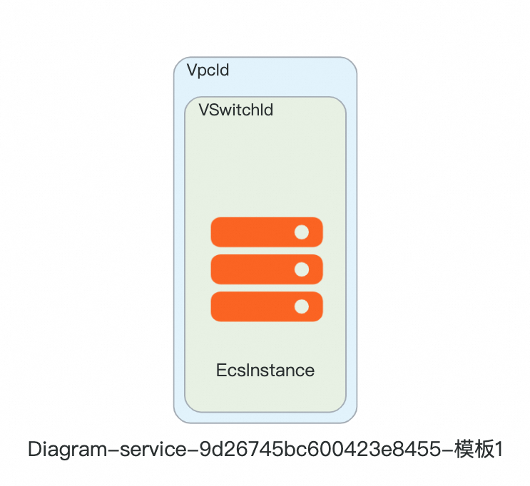
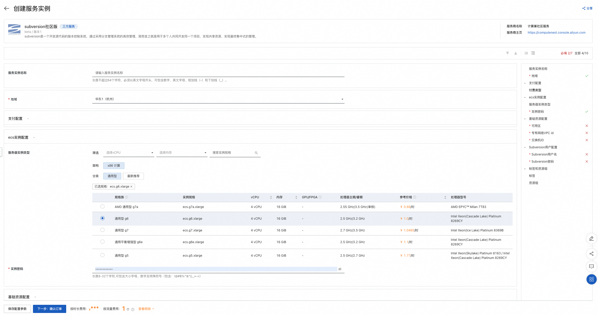
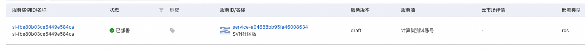
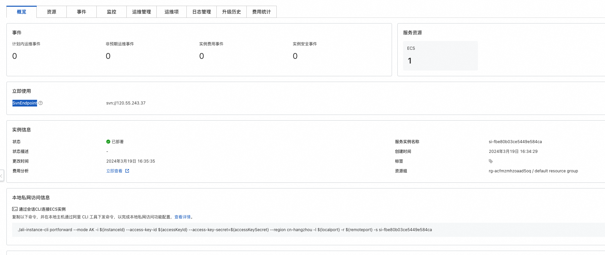

# Subversion服务私有化一键部署文档

## 概述
Subversion是一个开放源代码的版本控制系统，通过采用分支管理系统的高效管理，简而言之就是用于多个人共同开发同一个项目，实现共享资源，实现最终集中式的管理。
## 计费说明
Subversion服务在计算巢上部署的费用主要涉及：
- 所选vCPU与内存规格
- 磁盘容量

计费方式包括
- 按量付费（小时）
- 包年包月

## 部署架构

Subversion是单机部署架构

## RAM账号所需权限
Subversion服务需要对ECS、VPC等资源进行访问和创建操作，若您使用RAM用户创建服务实例，需要在创建服务实例前，对使用的RAM用户的账号添加相应资源的权限。
添加RAM权限的详细操作，请参见为RAM用户授权。所需权限如下表所示。

| 权限策略名称 | 备注 |
| --- | --- |
|AliyunECSFullAccess|	管理云服务器服务（ECS）的权限|
|AliyunVPCFullAccess|	管理专有网络（VPC）的权限|
|AliyunROSFullAccess|	管理资源编排服务（ROS）的权限|
|AliyunComputeNestUserFullAccess|	管理计算巢服务（ComputeNest）的用户侧权限|
|AliyunCloudMonitorFullAccess|	管理云监控（CloudMonitor）的权限|

## 部署流程
### 部署步骤

单击[部署链接](https://computenest.console.aliyun.com/service/instance/create/cn-hangzhou?type=user&ServiceId=service-9d26745bc600423e8455)，
进入服务实例部署界面，根据界面提示，填写参数完成部署。

### 部署参数说明
您在创建服务实例的过程中，需要配置服务实例信息。下文介绍Subversion社区版服务实例输入参数的详细信息。

| 参数组        | 	参数项                                                                         |	示例|	说明|
|-----------|------------------------------------------------------------------------------| --- | --- |
| 服务实例名称	| 	   | test                  |	实例的名称|                                                                         
| 地域	|    |华东1（杭州）|	选中服务实例的地域，建议就近选中，以获取更好的网络延时。     |                                              
| 支付配置| 	付费类型	| 按量付费 或 包年包月    | |                                                                  
| ECS实例配置| 	实例类型|	ecs.g6.large|	实例规格，可以根据实际需求选择  |                                                   
| ECS实例配置| 	实例密码	|********|	设置实例密码。长度830个字符，必须包含三项（大写字母、小写字母、数字、()`!@#$%^&*-+={}[]:;'<>,.?/ 中的特殊符号）| 
| 基础资源配置| 	部署区域|	可用区I|	地域下的不同可用区域  |                                                                
| 基础资源配置| 	VPC ID|	vpc-xxx|	选择专有网络的ID。    |                                                         
| 基础资源配置| 	交换机|	vsw-xxx|	选择交换机ID。若找不到交换机, 可尝试切换地域和可用区  |                                          
| Subversion用户配置|  Subversion用户名 | svn_user |
| Subversion用户配置| Subversion密码       | svn_password |  |

### 验证结果
查看服务实例。 服务实例创建成功后，部署时间大约需要1分钟。部署完成后，页面上可以看到对应的服务实例。

进入服务实例概览页后，可以通过SvnEndpoint和设置的Subversion用户名访问Subversion服务。

### 使用Subversion服务

请访问Subversion官网了解如何使用Subversion：[Subversion官网](https://subversion.apache.org/)
